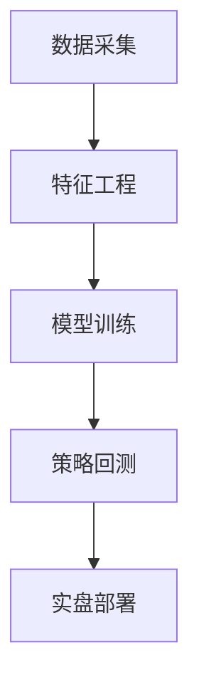

# 毕业设计项目：基于机器学习的量化选股系统

## 技术实现方案
### 核心算法
- 采用XGBoost与LightGBM融合模型（参考文献[4][6][8]）
- 引入LSTM处理时序特征（参考文献[5][9]）
- 集成Elastic Net特征选择（参考文献[3]）

### 系统架构


## 开发路径
1. **数据准备阶段（2周）**
   - 获取沪深300成分股数据
   - 构建财务、量价、舆情多维度因子库

2. **模型开发阶段（3周）**
   - 实现特征选择模块
   - 开发模型融合框架
   - 构建动态权重调整机制

3. **回测验证阶段（2周）**
   - 设计多维度评价指标
   - 进行参数敏感性分析
   - 优化过拟合防护机制

## 关键实施步骤
### 数据预处理
- 实现基于pandas的缺失值插补
- 开发行业中性化处理模块
- 构建标准化流水线

### 模型优化
```python
# 示例代码框架（参考文献[8]）
def model_ensemble():
    """多模型加权集成框架"""
    xgb_model = XGBoostMultiObjective()
    lgb_model = LightGBMTemporal()
    return DynamicWeightedAverage([xgb_model, lgb_model])
```

## 参考文献
[1] 陈创练. Stacking框架下Boosting算法融合模型...
[2] 吴炳鑫. 基于LightGBM的多因子量化选股策略...
[3] 陈友祝. Elastic Net分位数回归多因子策略...
[4] 李想. XGBoost算法多因子选股方案...
[9] 叶旭枫. 机器学习与高频因子预测研究...